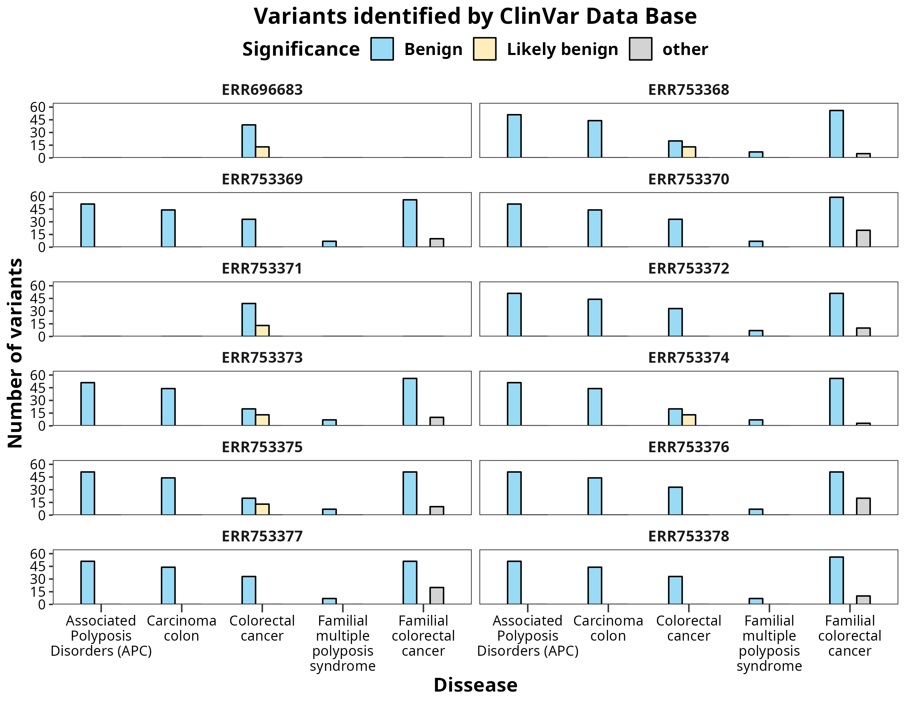

# **END OF MASTER'S PROJECT: Development of a Snakemake pipeline for automated and reproducible WES analysis**

## **INTERNACIONAL VALENCIAN UNIVERSITY (VIU) | 2022 - 2023 |** 

* ### **Author**: Juan Carlos García Estupiñán 

* ### **Supervisor**: Dr. Carolina Monzó Cataluña

---

* **Specific Computer Software/Features:**

  
  | **Software** | **Version** |
  | ------------ | ----------- |
  | Ubuntu       |  22.10      |  
  | Git          |  2.37.2     |
  | Conda        |  23.1.0     |
  | mamba        |  1.3.1      |

  * **RAM**: 16 Gb.
  * **Memmory** size: 500 Gb

---
--- 

### **TABLE OF CONTENTS**

1. [TOPIC](#topic)
2. [OBJECTIVE](#objective)
3. [DATA OF USED (EBI/ENA)](#data-obtained-from-a-paper-in-a-public-repository-localized-in-eropean-bioinformatics-instituteeuropean-nucleotide-archive-ebiena)
4. [DIRECTORIES](#directories) 
8. [SNAKEMAKE FILES](#snakemake-files)
7. [REFERENCES](#references)

---

## **TOPIC** 

Automated, hierarchical, and cyclical pipline using Snakemake as a management system workflow, for colorectal cancer samples.

## **OBJECTIVE** 

A bioinformatics pipeline will be created that utilizes software capable of managing workflows: Snakemake (1) (check [here](https://snakemake.readthedocs.io/en/stable/#) it's web page with all the tutorials, and other interesting documentation)

This workflow aims to filter the genomic variants of 12 samples from a family with a history of colorectal diseases. To achieve this, it is necessary for the user to be able to repeat the workflow in cycles with the chromosomes of interest, targeting a specific gene. Here is the list:

* PIK3CA (chromosome 3)
* APC (chromosome 5)
* BRAF (chromosome 7)
* KRAS (chromosome 12)
* TP53 (chromosome 17)

The workflow needs to have the following features: **order**, **reproducibility**, and **automation**.

## **DATA obtained from a paper in a public repository localized in Eropean Bioinformatics Institute/European Nucleotide Archive (EBI/ENA):** 
* ### Project ID: [PRJEB7926](https://www.ebi.ac.uk/ena/browser/view/PRJEB7926) (2)
* ### Title: [*GREM1* and POLE variants in hereditary colorectal cancer syndromes](https://onlinelibrary.wiley.com/doi/10.1002/gcc.22314)

## **DIRECTORIES**

### **Developed programms [Code](code)**

In this directory, we have the scripts attached to the Snakemake files. Additionally, there is an additional directory containing the conda environments for the software required to run the "rules".

* ***Conda*** environments in the directory [environments](code/environments/) (all of them have in common that they have snakemake).

    * [Greference_tools.yml](code/environments/Greference_tools.yml):There are tools available for reference genome mapping, as well as additional Python tools for data analysis, such as `numpy` and `pandas`.
    * [vep](code/environments/vep.yml): Software that enables users to perform "**Variant Effect Prediction**" (VEP) through the command line, facilitating variant annotation. 

    * [biostatisticsR](code/environments/biostatisticsR.yml): R programming language tools for manipulating data, statistical analysis and plotting.

	* [igv_viz](code/environments/igv_viz.yml): This environment is used for obtaining the Integrative Genomic Viewer (IGV), which allows for a better understanding of mapping reads by visualizing them. 

* Developed scripts:

    * [01dl_rawdata.sh](code/01dl_rawdata.bash): This script will download the BAM files from the public repository. In order to work, it needs to have a table in the metadata named report.tsv [(check report.tsv)](metadata/report.tsv), a file with important information about the project. The specific field of interest is the **number 8** (name: ***submitted_ftp***).  

    * [02rename.py](code/02rename.py): This Python script will rename the original BAM files using their sample names, making it easier to work with them.

    * [03extracting_fastq.sh](code/03extracting_fastq.sh): Pre-processing of the original BAM files. First the chromosome of interest will be filtered into a new BAM file. Then, from that file, the FASTQ files for both type of reads (forward and reverse) will be extracted. 

    * [04vep.sh](code/04vep.sh): Will download some files for running ClinVar in the CLI.

    * [05parsing_vep_data.R](code/05parsing_vep_data.R): Filter the gene of a chromosome of interest, from the VEP tables, for each sample. 

    * [06final_plot.R](code/06final_plot.R): Plotting the data using ```ggplot2``` package from R.
  
* Analysis *post-snakemake workflow* named **[analysis](code/analysis/)**: this is a directory with notebooks, other deloped programms, and the results of them for data analysis of the files obtained from the snakemake workflow. Sub-directories:
  * [notebooks](code/analysis/notebooks/): Jupyter Notebooks: 
    * The first of them, [annotations.ipynb](code/analysis/notebooks/annotations.ipynb), has the analysis of the data. 
    * There is another not for data analysis but give some isntructions to execute the rules of the snakemake workflow, named [instructions.ipynb](code/analysis/notebooks/instructions.ipynb).

  * [script_analysis](code/analysis/scripts_analysis/): some scripts for the data analysis, they are made, in order to be executed from the some of the notebook cells of the notebook [annotation.ipynb](code/analysis/notebooks/annotations.ipynb).

    * [01calculating_length.sh](code/analysis/scripts_analysis/01calculating_length.sh): script to calculate the mean length of the sequences.
    * [02joining_files.sh](code/analysis/scripts_analysis/02joining_files.sh): this script is a continuation from before, to joined the results of the samples together.
    * [03plot_mean_len.R](code/analysis/scripts_analysis/03plot_mean_len.R): plotting the data from the mean length of the samples.
    * [04fastp_analysis.sh](code/analysis/scripts_analysis/04fastp_analysis.sh): getting the number of sequences from the raw samples, and the samples after doing fastp.
    * [05flagstats.sh](code/analysis/scripts_analysis/05flagstats.sh): processing the flagstats statistics from metadata/logs/.
    * [06plot_flagstats.R](code/analysis/scripts_analysis/06plot_flagstats.R): plotting the results from the previous script.
    * [07vcfstats.sh](code/analysis/scripts_analysis/07vcfstats.sh): processing the vcfstats files in metadata/logs after the extract of variants into VCF.
    * [08ploting_vcfstats.R](code/analysis/scripts_analysis/08ploting_vcfstats.R): plotting the previous results.
    * [09statistical_analysis.R](code/analysis/scripts_analysis/09statistical_analysis.R): statistical analysis with R to do some inference from the vcfstats data (ratios heterocygotes/homocygotes)
    * [workflow_viz.py](code/analysis/scripts_analysis/workflow_viz.py): a Python script make an image of the rules in the *Snakefile*.

  * [results_analysis](code/analysis/results_analysis/): results with [tables](code/analysis/results_analysis/tables/) and [plots](code/analysis/results_analysis/plots/) *post - snakemake workflow*.

### **[Data](data)**

1. [ClinVar](data/ClinVar/): Data in order to get information from ClinVAR using VEP in CLI.

2. [original_bam](data/original_bam/): This is where the original BAM files, downloadaded thanks to the *01dl_rawdata.sh*, will be stored .

3. [processed](data/processed/): Directory that stores the FASTQ files pre-processed by ```fastp```.

4. [raw](data/raw/):Here is where the "raw" forward and reverse reads have been stored, but for this task, they are not raw reads per se. Instead, they are preprocessed data from the original BAM files, filtered for one chromosome. The reason is to avoid presenting a heavy computational load due to the large size of the original **FASTQ** files.. 

5. [reference](data/reference/): Here is where we store the reference genome (isolated chromosomes from the human genome)..


### **[Metadata](metadata)**

1. [report.tsv](metadata/report.tsv): File containing information and download links for the data provided by the public repository. Field 8 is used to download the data in the script [01dl_rawdata.sh](code/01dl_rawdata.bash).

2. [table3.csv](metadata/table3.csv): Table provided by the authors containing additional information about the WES they performed.

### **[Results](results)**

* Here, the results generated by executing each of the rules in the Snakefile are created and saved.

## **SNAKEMAKE FILES**

*  [config.yaml](config.yaml): This is a very important file that connects the study samples and the parameters of the Snakefile. It provides flexibility to the workflow, allowing modifications according to the chromosome/gene of interest, as well as assigning other types of parameters.

* [Snakefile](Snakefile): Snakefile to execute the rules and run the workflow in an organized manner. There are a total of 15 rules that must be followed precisely. It will be specified which ones need to be executed only once with ***"1 time"*** and which ones are repeated ***cyclically*** (i.e., once per parsed chromosome/gen). These are the rules (excluding the rule all, which intends to condition parameters for the ones performing a task):

	1. ```rule download_data``` (***1 time***): We download the data. The code has a trick: it takes a long time to download the data (~2 hours per file). If you stop the rule (Ctrl+C), the next time you run the script, the files that are already on your computer will not be downloaded again (```"===>>> THE FILE x.bam ALREADY EXISTS!!! <<<==="```). However, there's a catch: if one of the files has not been fully downloaded (the last one being attempted), you need to delete the partially downloaded file. The script does not differentiate how much has been downloaded, only whether the file name exists or not. With this, the download of these files can be organized. 
	2. ```rule pre_processing``` (***cyclically***): Pre-processed of the original BAM fiels (```samtools```).  
	3. ```rule reference_genome``` (***1 time***): Downloading the reference genome. The reference genome used was ***GRCh38 109 version***. 
	4. ```rule fastqc``` (***cyclically***): Perform a primary inspection of the "raw" files (```fastqc```).
	5. ```rule fastp``` (***cyclically***): Fix the "raw" data files ```fastp```.
	6. ```rule fastqc_trimmed``` (***cyclically***): Perfom a secondary inspection of the fixed raw data files (```fastqc```). 
	7. ```rule bwa_mapping``` (***cyclically***): Mapping with a reference genome using the ```bwa```.
	8. ```rule sam_to_bam``` (***cyclically***): Transforming SAM files into BAM (```samtools```)
	9. ```rule delete_duplicates``` (***cyclically***): delete duplicates of the sorted BAMS, using ```picard``` tools.
	10. ```rule extracting_variants``` (***cyclically***): Extracting variants to create Variant Call Files (VCF) (using ```freebayes```)
	11. ```rule vep_install_db``` ***"1 time"***: Downloading **ENSEMBLE** identified variants from databases of our species and reference genome. (```vep_install```). The reference genome used was ***GRCh38 109 version*** again.
	12. ```rule vep_cli``` (***cyclically***): Running Variant Effect Predictor in the command line (```vep```).
	13. ```rule parsing_dataR``` (***cyclically***): We use R to filter data for a specific gene from any of the chromosomes. First, the parsing script will be run for each sample separately, and then a code will be executed to save a table with all the samples together in joined_tables for a specific gene (e.g., APC.tsv). It is crucial not to delete the tables for each gene.
	15. ```rule R_plotting``` ***"1 time"***: Once the workflow for the 5 chromosomes (which will also obtain the variants of the 5 target genes) to be analyzed is completed, this rule can be executed. Two graphs will be created, which are the ultimate goal of the workflow, demonstrating the potential of this type of flow. The first graph will display the total variants detected in the chromosome, while the second graph will show the filtered variants from ClinVar directly related to colorectal diseases.

---
<p align="center">
 
  

</p>

<p align="center">
 
  

</p>


---

## **REFERENCES**

1. Mölder F, Jablonski KP, Letcher B, Hall MB, Tomkins-Tinch CH, Sochat V, Forster J, Lee S, Twardziok SO, Kanitz A, Wilm A, Holtgrewe M, Rahmann S, Nahnsen S, Köster J. Sustainable data analysis with Snakemake. F1000Res. 2021 Jan 18;10:33. doi: 10.12688/f1000research.29032.2. PMID: 34035898; PMCID: PMC8114187.

2. Rohlin A, Eiengard F, Lundstam U, Zagoras T, Nilsson S, Edsjö A, et al. *GREM 1* and POLE variants in hereditary colorectal cancer syndromes. Genes Chromosomes Cancer. Jan 2016;55(1):95-106

