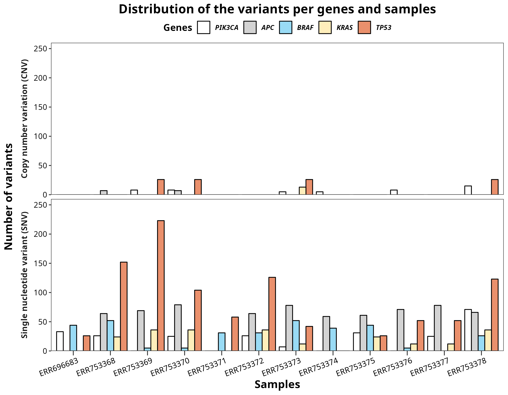

# Trabajo de Fin de Máster 

## Universidad Internacional de Valencia (VIU)

### Alumno: Juan Carlos García Estupiñán

Tema Cáncer de colorrectal. Pipeline automatizado, jerárquico y cíclico usando snakemake como controlador de flujo de trabajo.

## **Objetivo** 

Se creará un pipleine en el que se usará un software que permite el control de flujo de trabajo: **Snakemake** (ver [aquí](https://snakemake.readthedocs.io/en/stable/#) su página web con intrucciones y tutoriales entre otras cosas de utilidad). 

Este flujo de trabajo tiene como objetivo parsear las variantes genómicas de 12 muestras que provienen de una familia con propencia a enferemidades colorrectales. Para ello se hará de tal forma que se pueda repetir el flujo de forma cíclica con varios cormosomas con un gen target específico, estos genes serán:

* PIK3CA (cromosoma 3)
* APC (cromosoma 5)
* BRAF (cromosoma 7)
* KRAS (cromosoma 12)
* TP53 (cromosoma 17)


Contará con las siguienes características: **orden**, **reproducibilidad** y **automatización**.

## DATA sacada de un artículo en un repositorio público: 
* ### Identificador: [PRJEB7926](https://www.ebi.ac.uk/ena/browser/view/PRJEB7926)
* ### Artículo: [*GREM1* and POLE variants in hereditary colorectal cancer syndromes](https://onlinelibrary.wiley.com/doi/10.1002/gcc.22314)

## **Directorios**

### **[Código](code) empleado en la carpeta**

En este directorio tenemos los scripts vinculados a los archivos de Snakemake así como un directorio adicional con los ambientes necesarios para poder ejecutar las "**reglas**".

* Ambientes que se encuentran en el directorio [enviroments](code/enviroments/), todos obviamente tienen snakemake:

    * [Greference_tools.yml](code/enviroments/Greference_tools.yml): en este ambiente se encuentran herramientas para realizar mapeado de genoma de referencia, así como algunas librerías adicionales de *Python* como por ejemplo ```numpy``` y ```pandas```
    * [vep](code/enviroments/vep.yml): en este se encuntra lo necesario para realivar "***Variant Effect Prediction***" (*VEP*) para realizar la anotación de variantes.

    * [biostadisticsR](code/enviroments/biostatisticsR.yml): herramientas de R para realizar manipulación de datos, análisis estadísticos y gráficas.

	* [igv](code/enviroments/biostatisticsR.yml): con este ambiente se descarga El visualizador Integrative Genomic Viewer, con el que podemos ver el mapeado de una forma más visual.

* Scripts con los programas desarrollados:

    * [01dl_rawdata.sh](code/01dl_rawdata.bash): script que descarga los BAMs del repositorio público. Para su funcionamiento es necesario tener en los metadatos la siguiente tabla llamada report.tsv en los metadatos, obtenida de este repositorio: [metadatos (report.tsv)](metadata/report.tsv).

    * [02rename.py](code/02rename.py): script de python que sirve para cambiar los nombres de los archivos (muestras BAM).

    * [03extracting_fastq.sh](code/03extracting_fastq.sh): script de Bash con el que se pretende hacer un pre-procesado de los datos. Objetivo: filtrar de los archivos BAM originales uno de los cromosomas y pasarlos a formato fastq (lecturas forward y reverse).

    * [04join_samfiles.sh](code/04join_samfiles.sh): unimos los archivos *SAM* que han sido obtenidos al pasar los en un procesamiento con ```fastp``` (proceso se encuentra en el archivo Snakefile) *fastq.gz* a este formato.

    * [05sam_to_bam.sh](code/05sam_to_bam.sh): convertimos los archivos SAMs unidos y los transformamos en *BAMs*, además de indexarlo y ordenamos.

    * [06delete_duplicates](code/06delete_duplicates.sh): eliminamos los elementos duplicados de los archivos BAM ordendados.

    * [07extracting_variants.sh](code/07extracting_variants.sh): extraemos los varientes en un archivo *VCF*.

    * [08vep.sh](code/08vep.sh): corremos VEP en la línea de comandos.

    * [09parsing_vep_data.R](code/09parsing_vep_data.R): filtramos el gen que nos interesa de las tablas obtenida por la predicción de variantes con VEP de cada una de las muestras.

    * [10final_plot.R](code/10final_plot.R): Graficamos las tablas R, así como obtener tablas html.

    * [annotations.ipynb](code/annotations.ipynb): Jupyter Notebook con el que se obtienen tablas que nos permiten obtener las muestras del artículo, además de otras tablas que permiten analizar los datos (alojadas en los [metadatos](metadata))

    * [design_final_plot.ipynb](code/design_final_plot.ipynb): Jupyter Notebook en que se ha hecho un diseño del plot final.

### **[Data](data)**

1. [ClinVar](data/ClinVar/): Datos para obtener información de ClinVar mediante VEP en línea de comandos. 

2. [original_bam](data/original_bam/): en este repositorio se guardan los *BAM* del artículo que se descargan con el script 01.

3. [processed](data/processed/): donde procesamos los datos de FASTQ de data/raw/ medinate ```fastp```.

4. [raw](data/raw/): aquí es donde se han guardado las lecturas forward y reverse "crudas", para este trabajo no los son en sí, sino que son datos pre-procesados de BAM originales, para filtrar uno de los cromosomas. La razón es no presentar recursos computacionales suficienetes la gran peso de los archivos **FASTQ** originales. 

5. [reference](data/reference/): donde guardamos el genoma de referencia (cormosomas aislados del genoma humano).


### **[Metadatos](metadata)**

1. [report.tsv](metadata/report.tsv): archivo con información y links de descarga de los datos proporcionados por el repositorio público. Se hace **uso** del campo ***8*** para descargar los datos en el script [01dl_rawdata.sh](code/01dl_rawdata.bash).

2. [severe_consequences.csv](metadata/severe_consequences.csv): tabla obtenida de **ENSEMBLE** usando el Jupyter Notebook [annotations.ipynb](code/annotations.ipynb), que muestra la severidad de los tipos de variantes, la que se usará en el script [11plotting.R](code/11ploting.R) para extraer esta información de los datos.

3. [table3.csv](metadata/table3.csv): tabla que proporcionan los autores para una información adicional sobre la secuenciación que realizaron.

### **[Resultados](results)**

* Aquí se van creando y guardando los resultados que se van ejecutando cada una de las ***reglas*** del fichero Snakefile.

### **Archivos adicionales de control de flujo de trabajo**

*  [config.yaml](config.yaml): archivo muy importante en el que se guardan conectan las muestras de estudios y los parámetros del archivo Snakefile. Le da flexibilidad al workflow para modificarlo sergún el cromosoma/gen que queramos analizar, así como asignar otro tipo de parámetros. 

* [Snakefile](Snakefile): archivo de snakemake para ejecutar las relgas (***"rules"***) y ejecutar el flujo de trabajo de forma ordenada. En total hay 15 reglas las cuales deben seguirse al pie de la letra. Se especificará cuales de ellas hay que ejecutarse sólo un vez con "***1 vez***" y cuales de ellas varias como ***cíclica*** (es decir 1 vez por cromosoma/gen parseado). Estas serían las reglas (sin contar la ```rule all```, cuya intención es condiconar parametros a las que realizan un trabajo):

	1. ```rule download_data``` **(1 vez)**: Descargamos los datos. El código tiene truco, se tarda mucho en descargar los datos (~2 horas por archivo), si detienes la regla (ctrl C), el mismo script, la siguiente vez que la ejecutes, los archivos que ya están en tu ordenandor no volverán a descargarse (```"===>>> THE FILE x.bam ALREADY EXIST!!! <<<==="```). Tiene un **PERO**, si uno de ellos no se ha descargado del todo (el último que se estaba intentando), hay que eliminar lo descargado, el script no distingue cuánto, solo si el nombre del archivo está o no. Con esto se puede organizar la descarga de estos archivos. 
	2. ```rule pre_processing``` (***cíclica***): Preprocesado de los datos BAM originales (```samtools```).  
	3. ```rule reference_genome``` (***cíclica***): Descargar el genoma de referencia. 
	4. ```rule fastqc```: Realizar una inspección primaria de los archivos "crudos" (```fastqc```).
	5. ```rule fastp``` (***cíclica***): Arreglar los archivos crudos con ```fastp```.
	6. ```rule fastqc_trimmed``` (***cíclica***): Inspección secundaria de los archivos arreglados con el paquete anterior (```fastqc```). 
	7. ```rule bwa_mapping``` (***cíclica***): Mapeado con genoma de referencia usando el paquete ```bwa```.
	8. ```rule merge_sam_files``` (***cíclica***): Unimos los archivos SAM de las lecturas forward y reverse (```samtools```).
	9. ```rule sam_to_bam``` (***cíclica***): Transformamos los archivos SAM a BAM (```samtools```)
	10. ```rule delete_duplicates``` (***cíclica***): Eliminamos los reads duplicados, se usará ```picard``` tools.
	11. ```rule extracting_variants``` (***cíclica***): Extraemos del archivo BAM anteriores varianets en archivos VCF (usando ```freebayes```)
	12. ```rule vep_install_db``` **(1 vez)**: Descarga de **ENSEMBLE** variantes identificadas de bases de datos de nuestra especie y genoma de referencia (```vep_install```).
	13. ```rule vep_cli``` (***cíclica***): Después de la anterior podemos correr VEP desde la línea de comandos (```vep```).
	14. ```rule parsing_dataR``` (***cíclica***): Usamos R para filtrar los datos de un gen en concreto para eun cromosoma seleccionado. Primero se correrá el script para el parseado para cada una de las muestras por separado, y posterior se correrá un código que guardará una tabla con todas las muestras juntas en ```joined_tables``` para un gen en concreto enconcreto (por ejemplo: ***APC.tsv***). Es muy importante no borrar las tablas de cada gen.
	16. ```rule R_plotting``` **(1 vez)**: Una vez realizado el workflow para los 5 cormosomas (a su vez se obtendrán las variantes de los 5 genes target) a analizar, se podrá correr esta regla. El siguiente gráfico:

---
<p align="center">
 
  

</p>

---

* [your_sample_list.txt](your_sample_list.txt): **aunque no parezca gran cosa a simple viesta, es un* un archivo ***MUY*** importante e ***IMPRESCINDIBLE****. Permite **AUTOMATIZAR** los scripts. 

